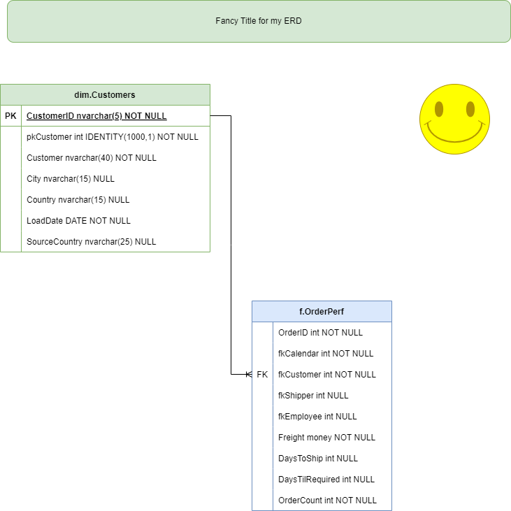

# Datamart Project
Repo for the final project in the datawarehouse design course.  
The scoring will be as follows:

- 2 pts - An explanation of your dataset  
- 3 pts - A list of points and / or questions that are being addressed with your data mart;  
- 5 pts - A diagram of your final mart (dimensions and fact(s)) - saved as .png or .svg from draw.io or similar tool;  
- 5 pts - SQL DDL (with markdown explanations) showing your table construction (in blocks in your .ipynb);  
- 10 pts - .sql file with your SQL DDL in the same folder as your .ipynb (must be runable);  
- 5 pts - SQL DML (with mardown explanations) showing your data loading from stage  
- 10 pts - .sql file with your SQL DML in the same folder as your .ipynb (must be runable);  

## After looking at this read me file, I would do the following in the read.me file (you can put it all in the .ipynb if you choose):
- In the read.me  
1) Place the Explanation of the dataset
2) The list of points / questions I am answering
3) The ERD of the mart (as shown below)

- in the .ipynb
The code and explanations of the code in the 2 sql files

You can access the ipynb [here](./Sample_Mart_Project_Template.ipynb).  

The mart will be constructed as follows:  

[SQL DDL Template](./data/StarSchemaTemplate.sql)  

[SQL DML Loader](./data/DataLoader.sql)  

